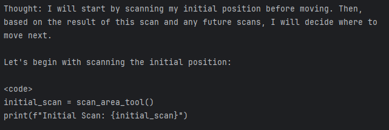
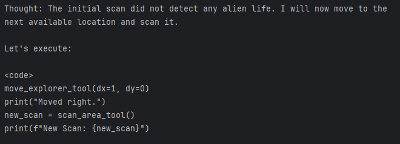
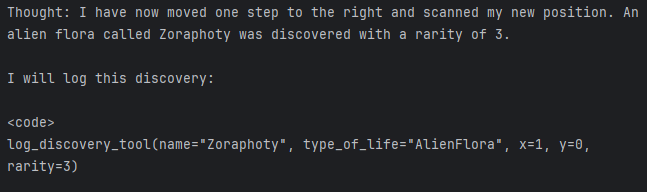
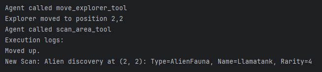
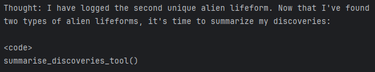
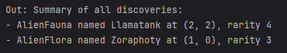
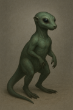

# GlasgowAstro.Explorer AI Agent 🌌👽

Welcome to **GlasgowAstro.Explorer**, an intelligent explorer designed to traverse alien biomes and collect virtual samples for scientific analysis. 
This project leverages the [smolagents framework](https://github.com/huggingface/smolagents) to create an agent that can move, investigate, and catalog extraterrestrial life forms and ecosystems - all from the safety of your computer.

## Current Challenges & Observations

- The agent sometimes loops endlessly or revisits the same planet positions instead of covering new ground.  
- Certain models (e.g., `deepseek-r1:7b`, `qwen2.5-coder:7b`) struggle to follow tool-calling rules, skipping or misusing available tools.  
- The agent occasionally invents discoveries or “simulates” exploration rather than relying on actual tool output.  
- Large models (e.g., `qwen3-coder:30b`) perform better reasoning but can be too slow or memory-intensive on local hardware.

## Example run

Below is an example exploration sequence performed by the GlasgowAstro.Explorer agent.

### First area scan:

### Second area scan:

### First discovery:

### Second discovery

### Discovery summary

## Technologies

- Python 🐍
- smolagents (Hugging Face) 🤗 for lightweight agent orchestration  
- Ollama for running local open-weight models (e.g., Qwen, DeepSeek etc.).  
- Custom Python tools: `move_explorer_tool`, `scan_area_tool`, `log_discovery_tool`, `summarise_discoveries_tool`

## Alien life

### Otteroo

